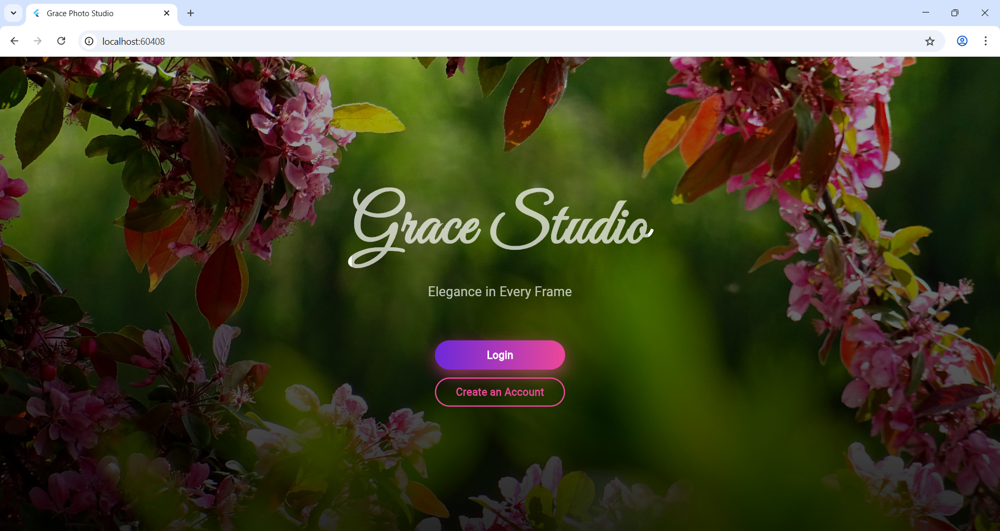
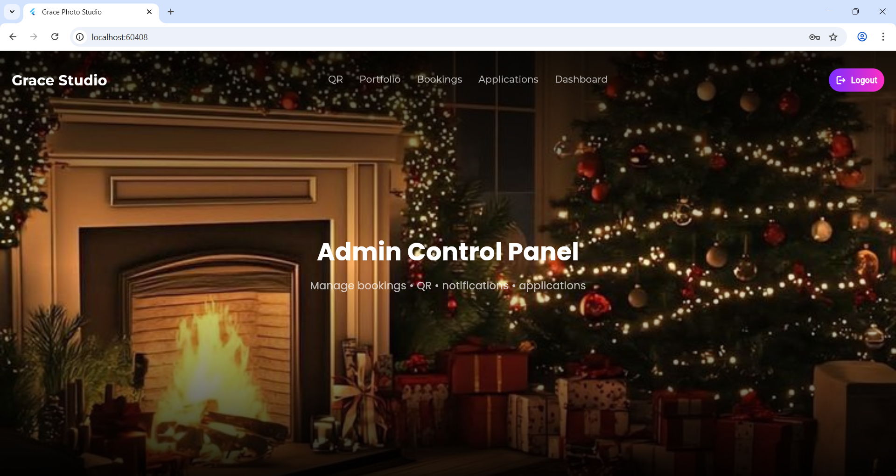
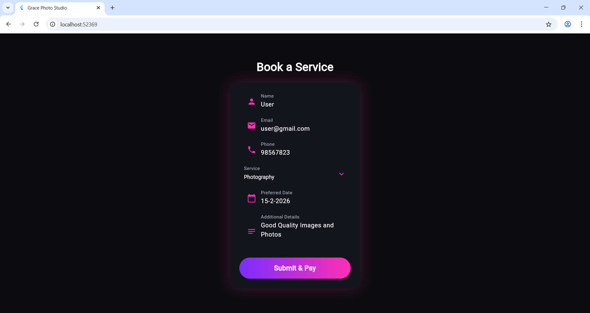
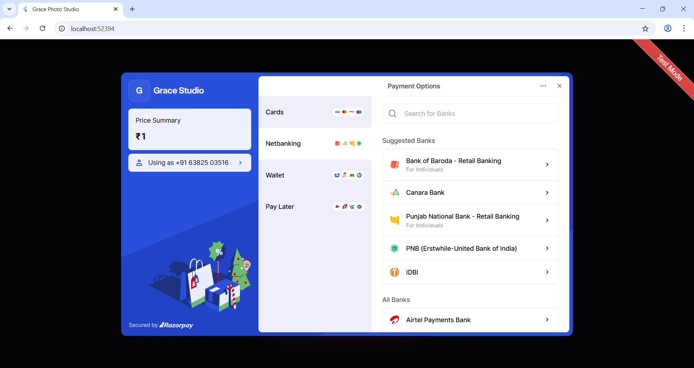

# 📸 Grace Studio | Professional Media Booking App

[](https://flutter.dev)
[](https://razorpay.com)
[](https://firebase.google.com)

**Grace Studio** is a premium, Flutter-powered cross-platform solution designed to bridge the gap between world-class media services and clients. Whether it's photography, videography, or drone cinematography, Grace Studio offers a high-performance interface for seamless scheduling and secure financial transactions.

## ✨ Key Features

### 💎 The Client Experience
* **Intuitive Service Suite:** Browse and select from high-end services like Editing, Drone Shoots, and Portraiture.
* **Dynamic Booking Engine:** A streamlined flow with integrated date/time pickers and custom requirement fields.
* **Secure Financials:** Fully integrated with **Razorpay** for industry-standard encryption and diverse payment methods.
* **Real-time Tracking:** Dedicated dashboard for booking status, payment history, and past project summaries.
* **Post-Service Engagement:** Built-in review and rating system to ensure quality control.

### 🛠 Technical Excellence
* **Cross-Platform Harmony:** Optimized for pixel-perfect performance on Android, iOS, and Web.
* **Role-Based Logic:** Secure user authentication and data privacy via Firebase.
* **Modern UI/UX:** Responsive layouts featuring smooth transitions and a minimalist design aesthetic.

### 📷 Prototype

<div align="center">
  
  
  
  
</div>

## 📱 App Walkthrough

1.  **Login & Identity:** Secure Firebase-backed authentication with email/password and recovery options.
2.  **Service Discovery:** A clean, visual interface to explore available photography and videography packages.
3.  **Booking Flow:** Select preferred dates, provide project notes, and proceed to checkout.
4.  **Payment Confirmation:** Instant feedback with Razorpay Payment IDs and success dialogs.
5.  **History & Profiles:** Comprehensive logs of all past bookings, upcoming schedules, and personal profile management.


## 🚀 Tech Stack

| Technology | Purpose |
| :--- | :--- |
| **Flutter & Dart** | UI Development & Business Logic |
| **Firebase** | Authentication & Cloud Data Storage |
| **Razorpay SDK** | Secure Payment Processing |


## 🛠 Installation & Setup

### Prerequisites
* **Flutter SDK** (v3.0.0 or higher)
* **Dart SDK**
* **Firebase Account** (for authentication)
* **Razorpay API Keys**

### Getting Started

1.  **Clone the Repository:**
    ```bash
    git clone [https://github.com/Akilesh-GA/GraceStudioWeb.git](https://github.com/Akilesh-GA/GraceStudioWeb.git)
    cd GraceStudioWeb
    ```

2.  **Install Dependencies:**
    ```bash
    flutter pub get
    ```

3.  **Configure Environment:**
    * Add your `google-services.json` (Android) and `GoogleService-Info.plist` (iOS) to their respective directories.
    * Initialize your Razorpay API keys in your configuration file.

4.  **Launch the App:**
    ```bash
    # For Web
    flutter run -d chrome  

    # For Mobile
    flutter run           
    ```

## 📅 Future Roadmap
* [ ] **AI Scheduling:** Automated slot suggestions based on photographer availability.
* [ ] **Client Gallery:** In-app digital delivery of high-resolution media.
* [ ] **Push Notifications:** SMS and Email alerts via Twilio/SendGrid integration.
